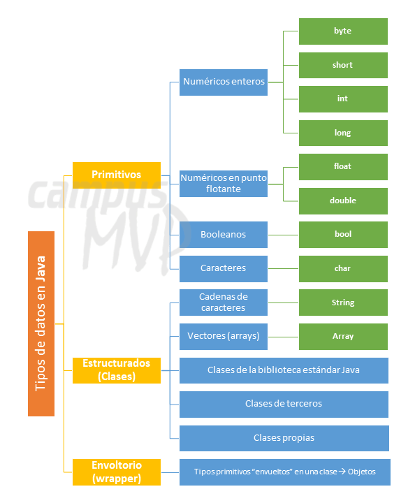

# Variables

Una variable es el nombre dado a una ubicación de memoria. Es la unidad básica de almacenamiento en un programa. El valor almacenado en una variable se puede cambiar durante la ejecución del programa.

## Cómo declarar variables en Java:

- **Tipo de dato**: tipo de datos que se pueden almacenar en esta variable.
- **nombre_variable**: nombre dado a la variable.
- **valor**: es el valor inicial almacenado en la variable.
- Finalizar con ";"\

Ejemplos:

``
    float simpleInterest; //Declarando variable float
    int time = 10, speed = 20; //Declarando e Inicializando la variable integer
    char var = 'h'; // Declarando e Inicializando la variable character
``
