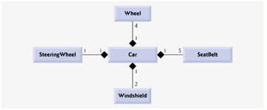

# Composición

**Composición quiere decir que tenemos una instancia de una clase que contiene instancias de otras clases que implementan las funciones deseadas**.

Es decir, estamos delegando las tareas que nos mandan a hacer a aquella pieza de código que sabe hacerlas. El código que ejecuta esa tarea concreta está sólo en esa pieza y todos delegan el ella para ejecutar dicha tarea. Por lo tanto estamos reutilizando código de nuevo.

Vamos a ver un esquema como en el caso anterior:

En este caso decimos que el coche esta compuesto por ruedas, volante, cinturones de seguridad, luna… es decir, el coche tiene elementos o usa elementos para hacer todas las funciones que puede realizar. Delega sus responsabilidades en colaboradores designados para cada responsabilidad.

Esta forma de diseñar nuestro software  **nos permite que el resultado sea un sistema mucho más flexible en tiempo de programación e incluso en tiempo de ejecución**.
