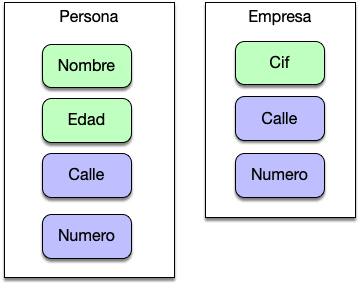
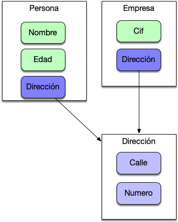

# Composición

**Composición quiere decir que tenemos una instancia de una clase que contiene instancias de otras clases que implementan las funciones deseadas**.

Es decir, estamos delegando las tareas que nos mandan a hacer a aquella pieza de código que sabe hacerlas. El código que ejecuta esa tarea concreta está sólo en esa pieza y todos delegan el ella para ejecutar dicha tarea. Por lo tanto estamos reutilizando código de nuevo.

Un ejemplo podría ser el diseñar las Clases Persona , Empresa y Dirección . En un ejemplo muy básico tanto la Persona como la Empresa contienen ellas mismas la información de la dirección como propiedades individuales.

Este enfoque no favorece la reutilización ya que ambas clases comparten las propiedades y nos encontramos ante una situación sencilla de repetición de código . Para solventar este problema debemos apostar por un enfoque de composicion . En donde tanto Persona como Empresa se apoyan en la clase Dirección para gestionar el concepto de calle y numero.

Esta forma de diseñar nuestro software  **nos permite que el resultado sea un sistema mucho más flexible en tiempo de programación e incluso en tiempo de ejecución**.
