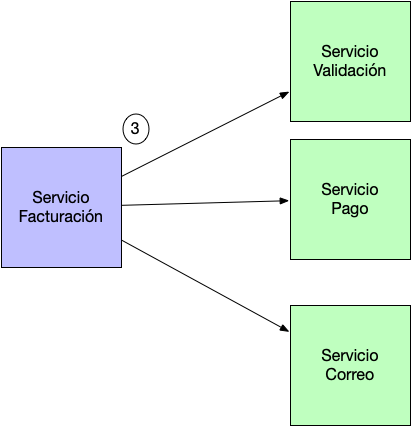
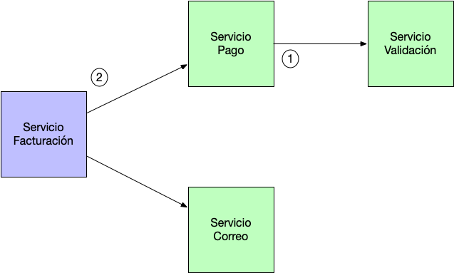

# Acoplamiento 
El acoplamiento es el grado en que los módulos de un programa  **dependen** unos de otros.

Si para hacer cambios en un módulo del programa es necesario hacer cambios en otro módulo distinto, existe acoplamiento entre ambos módulos.

En Programación Orientada a Objetos, si una clase X usa una clase Y, se dice que X depende de Y. Esto es, X no puede realizar su trabajo sin Y, por lo tanto, existe acoplamiento entre las clases X e Y.

Como se observa, el acoplamiento es direccional, puede haber acoplamiento de la clase X con la clase Y, pero esto no implica que exista en sentido inverso.

## a. Alto
Si existen muchas relaciones entre los componentes, con muchas dependencias entre ellos, tendremos un grado de acoplamiento alto. 

## b. Bajo
Si los componentes son independientes unos de otros, el acoplamiento será bajo.

El siguiente ejemplo se encarga de construir una serie de servicios que se encarguen de manipular la clase Factura.
En este caso estamos usando un ServicioFacturación que procesa la Factura , la valida paga y envía un correo confirmando que la Factura ha sido pagada. En principio el código es bastante razonable pero si mostramos un diagrama de clases nos daremos cuenta que estamos ante una relación de este tipo.

El servicioFacturación esta ligado a tres Servicios adicionales , el primero valida , el segundo Paga la factura y el tercero envía un correo con el pago realizado. Esto es lo que se denomina acoplamiento entre clases . Nuestra clase ServicioFacturación depende de otros servicios y por lo tanto cada cambio que realicemos en cualquiera de estas clases implica que el ServicioFacturación también se verá afectado.

¿Podemos mejorar de alguna forma el diseño?. En este caso no es muy complicado ya que probablemente la Factura debe ser validada antes de que realicemos el Pago . Así pues podríamos diseñar la relación de clases de la siguiente forma:

Hemos conseguido reducir el acoplamiento entre clases ya que ahora el servicioFacturación únicamente esta ligado a dos dependencias  y su acoplamiento  se ha reducido
